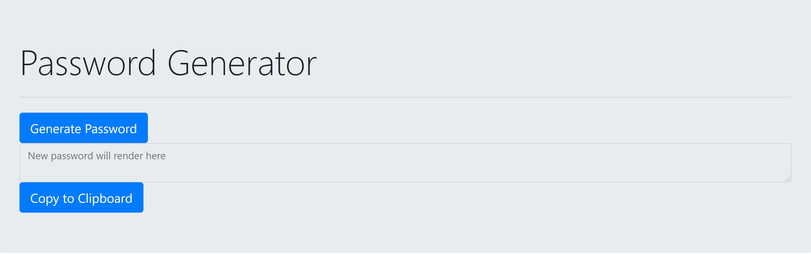

# UPenn-Week-3-Homework-JS-Password-Generator

The purpose of this application is to generate a random password based on user inputs. The user will be prompted to choose how long the password will be, and if they want to include at least one of the following character types: special characters, numbers, upper case letters, lower case letters. 

Here is what the password generator looks like:

Link to the webapp: https://tdj03001.github.io/UPenn-Week-3-Homework-JS-Password-Generator/

Sources:
https://www.w3schools.com/jsref/tryit.asp?filename=tryjsref_state_return2   I used this as a reference to figure out how to get something to show up in the <textarea> of my page.https://

www.w3schools.com/js/js_comparisons.asp    I used this to find the "not equal to" operator !==

https://www.kirupa.com/html5/picking_random_item_from_array.htm    Used this page for help with random value selection from arrays.